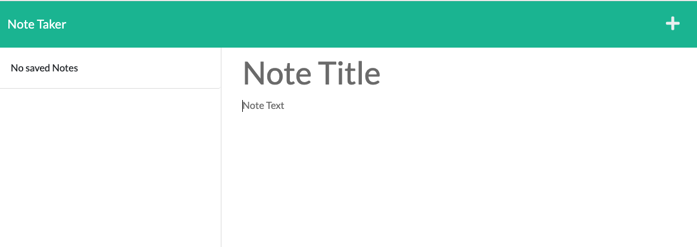

# NoteTaker

## Description
This simple web application is designed to function as a note taker. By using express.js back-end, the user can create, save, and delete notes while  

## Link to Deployed Application
View the live application by running the following heroku link:

## Link to GitHub Repository
https://github.com/parisa-ostovari/NoteTaker

## Screenshot
Here is the snapshot of how the website should look like:
 
