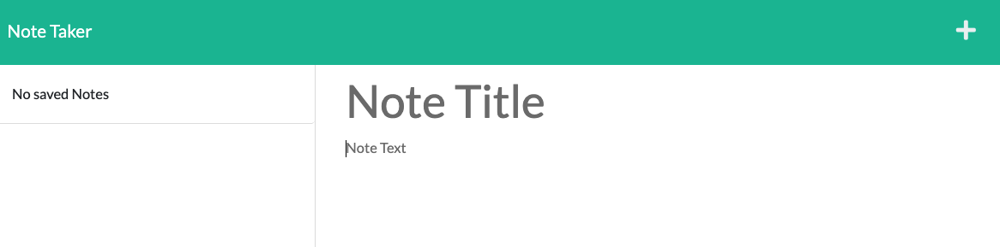

# NoteTaker

## Description
This simple web application is designed to function as a note taker. By using express.js back-end, the user can create, save, and delete notes while  

## Link to Deployed Application
View the live application by running the following heroku link:

https://note-taker-2022.herokuapp.com/

## Link to GitHub Repository
https://github.com/parisa-ostovari/NoteTaker

## License
Copyright © MIT 2021. All rights reserved.

Licensed under the MIT license.

Read more about it at https://opensource.org/licenses/MIT.

## Questions
If you have any questions please contact me at:

Email: parisaostovari@gmail.com
GitHub: https://github.com/parisa-ostovari

## Screenshot
Here is the snapshot of how the website should look like:

